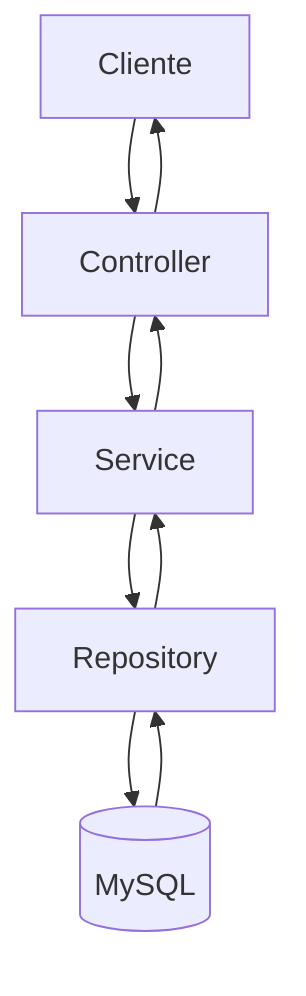
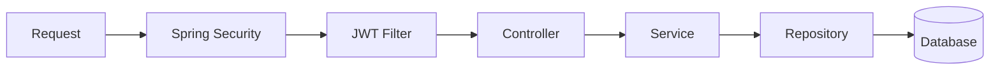
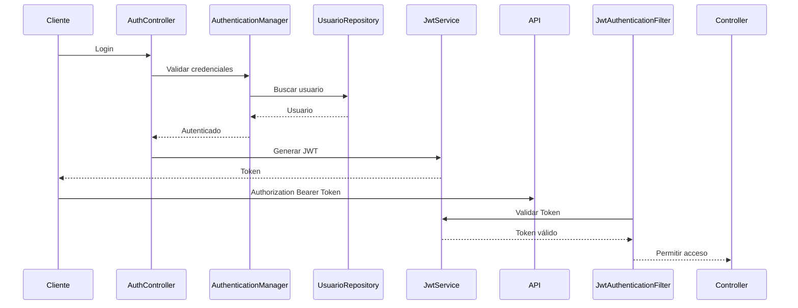

# Arquitectura del Sistema

## 1. Introducción

El Sistema de Gestión de Consultas Académicas es una API REST desarrollada con Kotlin y Spring Boot cuyo objetivo es gestionar el ciclo de vida de las consultas académicas realizadas por los estudiantes hacia los docentes.

El proyecto fue diseñado siguiendo una arquitectura en capas, aplicando principios de separación de responsabilidades, bajo acoplamiento y alta cohesión. Esta organización facilita el mantenimiento del código, la incorporación de nuevas funcionalidades y el trabajo colaborativo entre varios desarrolladores.

La arquitectura implementada busca que cada componente tenga una única responsabilidad, evitando que la lógica de negocio se mezcle con la capa de presentación o con el acceso a datos.


---
# 2. Objetivo del Backend

El backend es responsable de:

- Gestionar la autenticación de los usuarios.
- Autorizar el acceso mediante JWT.
- Administrar usuarios.
- Administrar programas académicos.
- Administrar módulos.
- Gestionar la recuperación de contraseñas.
- Validar la información recibida.
- Centralizar el acceso a la base de datos.
- Exponer una API REST documentada mediante Swagger.

Las funcionalidades relacionadas con Solicitudes de Consulta serán integradas posteriormente, una vez finalice su desarrollo.

---

# 3. Tecnologías utilizadas

El proyecto utiliza las siguientes tecnologías:

- Kotlin
- Spring Boot
- Spring Security
- Spring Data JPA
- Hibernate
- JWT
- BCrypt
- MySQL
- Gradle Kotlin DSL
- Java 17
- Bean Validation
- Swagger / OpenAPI

---

# 4. Arquitectura por capas

El proyecto sigue una arquitectura en capas donde cada nivel tiene responsabilidades claramente definidas.

Cliente

↓

Controller

↓

Service

↓

Repository

↓

MySQL

Esta separación evita dependencias innecesarias y facilita las pruebas, el mantenimiento y la escalabilidad del sistema.


---

# 5. Estructura de paquetes

El proyecto está organizado utilizando la siguiente estructura:

```text
co.edu.iub.sistemaconsultas

├── config
├── controller
├── dto
├── exception
├── mapper
├── model
├── repository
├── service
│   └── impl
└── util
```

Cada paquete tiene una responsabilidad específica dentro de la arquitectura.


---

## 6. Responsabilidad de cada paquete

### config

Contiene toda la configuración general del proyecto.

Ejemplos:

- Spring Security
- Beans
- JWT
- Swagger

### controller

Recibe las peticiones HTTP.

Su responsabilidad consiste únicamente en:

- recibir la solicitud
- validar el DTO
- delegar al Service
- retornar la respuesta

No contiene lógica de negocio.

### service

Define las interfaces de negocio utilizadas por la aplicación.

### service.impl

Implementa toda la lógica de negocio del sistema.

Aquí se realizan:

- validaciones funcionales
- reglas de negocio
- consultas a repositorio
- transformaciones necesarias

### repository

Contiene las interfaces que permiten acceder a la base de datos utilizando Spring Data JPA.

### dto

Define los objetos utilizados para la comunicación entre cliente y servidor.

Los DTO evitan exponer directamente las entidades JPA.

### mapper

Centraliza la conversión entre Entidades y DTOs mediante funciones de extensión de Kotlin.

### model

Contiene las entidades persistentes del sistema.

Cada entidad representa una tabla de la base de datos.

### exception

Centraliza el manejo uniforme de errores mediante excepciones personalizadas y un GlobalExceptionHandler.

### util

Agrupa componentes reutilizables que pueden ser utilizados desde diferentes módulos del proyecto.


---


# 7. Flujo de una petición HTTP

Una solicitud enviada por el cliente sigue el siguiente recorrido:

1. El cliente envía una petición HTTP.
2. Spring Security valida el JWT.
3. El Controller recibe la petición.
4. Bean Validation valida el DTO.
5. El Controller delega al Service.
6. El Service ejecuta la lógica de negocio.
7. El Repository interactúa con MySQL.
8. El resultado vuelve al Service.
9. El Service convierte la entidad mediante un Mapper.
10. El Controller retorna el DTO correspondiente.

Esta organización mantiene desacopladas todas las capas del sistema.

---

# 8. Seguridad

La seguridad se implementó utilizando Spring Security.

El acceso a los recursos protegidos requiere un JWT válido.

Las contraseñas nunca son almacenadas en texto plano, sino utilizando BCrypt.

Las rutas públicas actualmente son:

- /auth/login
- /auth/register
- /auth/forgot-password
- /auth/reset-password

El resto de endpoints requieren autenticación.

---

# 9. Autenticación JWT

La autenticación implementa un mecanismo Stateless.

Una vez autenticado:

- el usuario recibe un JWT
- el cliente almacena el token
- cada petición posterior envía dicho token
- Spring Security valida automáticamente su autenticidad

No se almacenan sesiones en el servidor.


---

# 10. Persistencia

La persistencia se implementa mediante Spring Data JPA utilizando Hibernate como proveedor ORM.

Las entidades representan las tablas de MySQL y los Repository abstraen la escritura de consultas SQL para las operaciones CRUD más comunes.

---

# 11. DTOs y Mappers

La aplicación no expone directamente las entidades JPA.

Cada operación utiliza DTOs específicos para:

- solicitudes (Request)
- respuestas (Response)

Los Mappers centralizan la transformación entre entidades y DTOs, evitando duplicación de código y manteniendo una separación clara entre la capa de persistencia y la API.

---

# 12. Bean Validation

La validación de datos se realiza utilizando Bean Validation.

Los DTO contienen anotaciones como:

- @NotBlank
- @Email
- @Size

Los Controllers utilizan @Valid para activar automáticamente las validaciones antes de ejecutar la lógica de negocio.

---

# 13. Manejo global de excepciones

El proyecto implementa un GlobalExceptionHandler que centraliza el tratamiento de errores.

Actualmente se manejan, entre otras, las siguientes excepciones:

- ResourceNotFoundException
- BadRequestException
- MethodArgumentNotValidException

Todas las respuestas de error mantienen un formato uniforme para facilitar el consumo de la API.

---

# 14. Documentación de la API

La API se documenta mediante Swagger/OpenAPI.

La documentación permite:

- consultar endpoints
- visualizar DTOs
- autenticarse mediante JWT
- ejecutar pruebas directamente desde la interfaz web

---

# 15. Eliminación lógica

Las entidades principales implementan eliminación lógica mediante el atributo:

activo

Cuando un registro es eliminado:

- no desaparece físicamente de la base de datos
- únicamente cambia su estado a inactivo

Este enfoque preserva la integridad histórica de la información.

---

# 16. Decisiones de arquitectura

Durante el desarrollo se tomaron las siguientes decisiones:

- utilización de DTOs en todas las operaciones
- separación entre interfaces Service e implementaciones ServiceImpl
- lógica de negocio exclusivamente en Services
- Controllers sin lógica de negocio
- PasswordEncoder ubicado en SecurityBeansConfig
- configuración de seguridad concentrada en SecurityConfig
- relación unidireccional entre PasswordResetToken y Usuario
- eliminación lógica como mecanismo estándar para preservar datos

Estas decisiones buscan mantener un código desacoplado, mantenible y fácil de extender.

---

# 17. Mejoras futuras

Entre las mejoras previstas se encuentran:

- integración completa del módulo SolicitudConsulta
- implementación de pruebas unitarias con JUnit y Mockito
- impedir la eliminación lógica de Programas Académicos que tengan usuarios activos asociados
- incorporación de auditoría de operaciones
- optimización de consultas mediante paginación y filtros avanzados