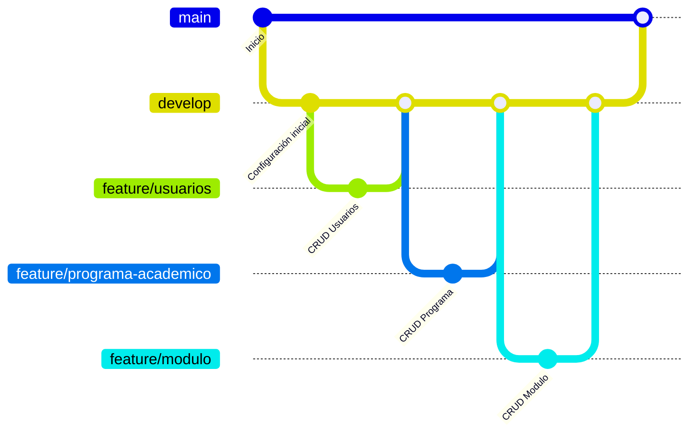

# Flujo de Trabajo con Git

## 1. Objetivo

Este documento describe la estrategia de trabajo con Git utilizada durante el desarrollo del **Sistema de Gestión de Consultas Académicas**.

Su propósito es mantener un historial de cambios limpio, facilitar el trabajo colaborativo y garantizar que todas las funcionalidades sean revisadas antes de integrarse a las ramas principales del proyecto.

---

# 2. Estrategia de ramas

El proyecto utiliza una estrategia basada en tres tipos principales de ramas:

- `main`
- `develop`
- `feature/*`

Además, cuando es necesario, se pueden crear ramas para documentación, seguridad o corrección de errores.

---

# 3. Descripción de las ramas

## main

La rama **main** contiene únicamente versiones estables del proyecto.

Características:

- Nunca se desarrolla directamente sobre ella.
- Solo recibe cambios provenientes de `develop`.
- Representa versiones listas para producción o entrega.

---

## develop

La rama **develop** es la rama principal de desarrollo.

Características:

- Integra todas las funcionalidades aprobadas.
- Es la base para crear nuevas ramas.
- Debe mantenerse siempre compilando correctamente.

---

## feature

Cada nueva funcionalidad debe desarrollarse en una rama independiente.

Formato:

```text
feature/nombre-funcionalidad
```

Ejemplos:

```text
feature/usuarios

feature/programa-academico

feature/modulo

feature/recuperar-password
```

---

## Otras ramas

Cuando el tipo de trabajo lo requiera podrán utilizarse ramas como:

```text
bugfix/nombre-error

hotfix/nombre-error

docs/nombre-documento

security/nombre-mejora
```

Ejemplos utilizados en este proyecto:

```text
security/bean-validation
```

---

# 4. Flujo de trabajo

Cada funcionalidad deberá seguir el siguiente proceso:

1. Actualizar la rama `develop`.
2. Crear una nueva rama para la funcionalidad.
3. Implementar el desarrollo.
4. Compilar el proyecto.
5. Probar la funcionalidad (Postman o Swagger).
6. Actualizar la documentación si aplica.
7. Realizar commits descriptivos.
8. Hacer Push al repositorio.
9. Crear Pull Request hacia `develop`.
10. Revisar el código.
11. Aprobar el Pull Request.
12. Realizar Merge.

Cuando `develop` se encuentre estable, se realizará un Pull Request hacia `main`.

---

# 5. Flujo gráfico del proyecto



---

# 6. Ciclo completo de desarrollo

Cada funcionalidad seguirá el siguiente ciclo:

```text
Actualizar develop

↓

Crear nueva rama

↓

Desarrollar funcionalidad

↓

Compilar proyecto

↓

Probar endpoints

↓

Actualizar Swagger

↓

Actualizar documentación

↓

Commit

↓

Push

↓

Pull Request

↓

Revisión

↓

Merge a develop
```

---

# 7. Convenciones para ramas

Las ramas deberán tener nombres claros y descriptivos.

Ejemplos válidos:

```text
feature/usuarios

feature/programa-academico

feature/modulo

feature/recuperar-password

docs/arquitectura

security/bean-validation

bugfix/login
```

No utilizar nombres genéricos como:

```text
prueba

nuevo

cambios

rama1
```

---

# 8. Convenciones para commits

Cada commit debe representar un cambio específico y fácilmente identificable.

Se utilizará la siguiente convención:

| Tipo | Descripción | Ejemplo |
|------|-------------|----------|
| feat | Nueva funcionalidad | feat: implementar autenticación JWT |
| fix | Corrección de errores | fix: corregir validación login |
| refactor | Reestructuración | refactor: extraer mapper |
| docs | Documentación | docs: actualizar Arquitectura.md |
| test | Pruebas | test: agregar UsuarioServiceTest |
| chore | Mantenimiento | chore: actualizar dependencias |

Evitar mensajes como:

```text
cambios

update

hola

123

último
```

---

# 9. Pull Request

Todo cambio deberá integrarse mediante Pull Request.

Antes de solicitar revisión verificar:

- El proyecto compila correctamente.
- No existen conflictos.
- Los endpoints funcionan correctamente.
- Swagger continúa operativo.
- La documentación fue actualizada cuando corresponde.
- No existen credenciales en el commit.

---

# 10. Revisión de código

Durante la revisión deberán verificarse los siguientes aspectos:

- Cumplimiento de la arquitectura por capas.
- Ausencia de lógica de negocio en Controllers.
- Uso correcto de DTO.
- Uso correcto de Mapper.
- Manejo adecuado de excepciones.
- Bean Validation implementado cuando sea necesario.
- Código limpio y legible.
- Eliminación de código comentado innecesario.

---

# 11. Merge

Una vez aprobado el Pull Request:

- Realizar Merge hacia `develop`.
- Verificar que el proyecto continúe compilando.
- Resolver conflictos si existen.
- Eliminar la rama de desarrollo cuando ya no sea necesaria.

Cuando `develop` represente una versión estable, realizar Merge hacia `main`.

---

# 12. Buenas prácticas

Durante el desarrollo se recomienda:

- Mantener ramas pequeñas.
- Realizar commits frecuentes.
- Mantener mensajes descriptivos.
- Sincronizar `develop` antes de crear una nueva rama.
- Actualizar la documentación junto con el código.
- Revisar los cambios antes del Push.
- Eliminar ramas que ya fueron integradas.

---

# 13. Errores comunes

Evitar las siguientes prácticas:

- Hacer Push directamente sobre `main`.
- Trabajar directamente sobre `develop`.
- Mezclar varias funcionalidades en una misma rama.
- Subir credenciales al repositorio.
- Omitir la revisión mediante Pull Request.
- Realizar commits con mensajes poco descriptivos.
- Fusionar ramas sin probar previamente el proyecto.

---

# 14. Ejemplo completo

A continuación se muestra el flujo seguido para desarrollar una nueva funcionalidad:

```text
main

↑
Pull Request

↑

develop

↑
Pull Request

↑

feature/modulo

↓

Desarrollo

↓

Pruebas

↓

Commit

↓

Push
```

Este flujo fue el utilizado durante el desarrollo de los módulos de Usuarios, Programas Académicos, Módulos y Recuperación de Contraseña, garantizando una integración controlada y un historial de cambios organizado.

---

# 15. Evolución del flujo de trabajo

El flujo descrito en este documento podrá evolucionar conforme el proyecto crezca o se incorporen nuevos integrantes al equipo.

Cualquier modificación en la estrategia de ramas o en el proceso de integración deberá reflejarse tanto en este documento como en el resto de la documentación técnica del proyecto.
