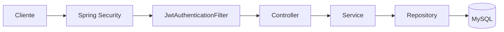
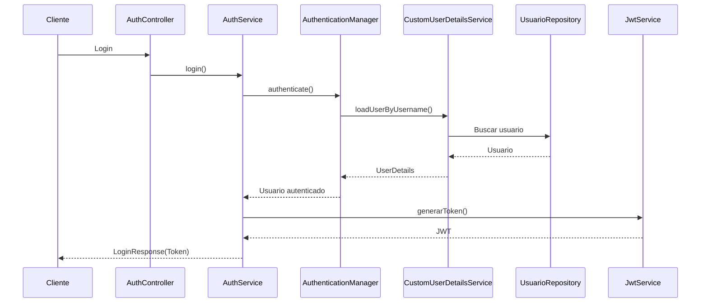
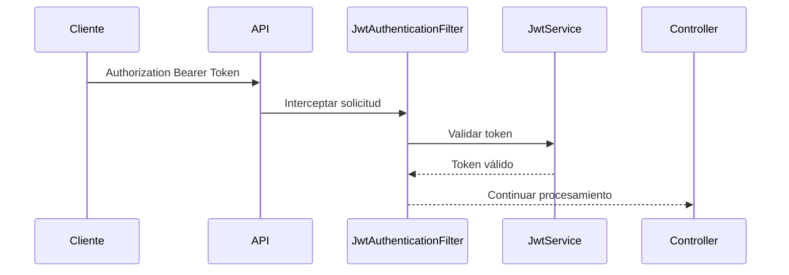
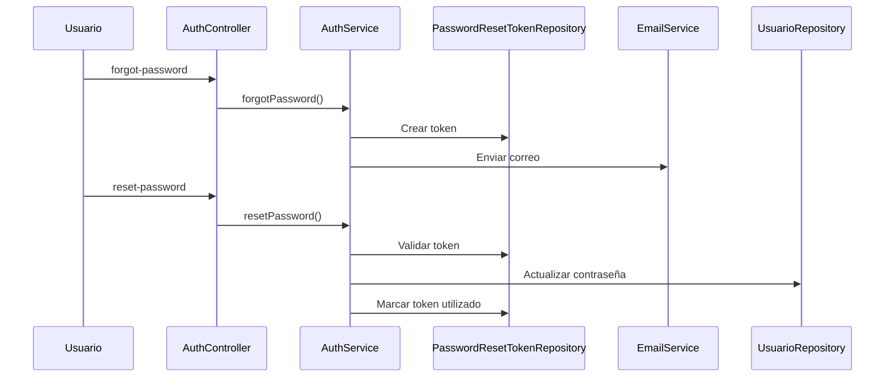

# Seguridad del Sistema

## 1. Introducción

La seguridad del **Sistema de Gestión de Consultas Académicas** se implementa utilizando Spring Security junto con JSON Web Token (JWT), siguiendo un modelo de autenticación **Stateless**.

En este modelo el servidor no mantiene sesiones de usuario. Después de autenticarse correctamente, el cliente recibe un JWT que deberá enviar en cada petición a los recursos protegidos.

Esta estrategia permite desarrollar una API REST escalable, desacoplada y alineada con las buenas prácticas recomendadas por Spring Security.

---

# 2. Objetivo

El módulo de seguridad tiene como finalidad:

- Autenticar usuarios.
- Autorizar el acceso a los recursos protegidos.
- Proteger las contraseñas utilizando BCrypt.
- Generar y validar JWT.
- Permitir la recuperación segura de contraseñas.
- Integrarse con Swagger para facilitar las pruebas de la API.

---

# 3. Componentes de seguridad

La implementación está compuesta por los siguientes componentes:

| Componente | Responsabilidad |
|------------|-----------------|
| SecurityConfig | Configuración de Spring Security |
| SecurityBeansConfig | Registro de Beans relacionados con seguridad |
| AuthenticationManager | Orquestar el proceso de autenticación |
| CustomUserDetailsService | Cargar usuarios desde la base de datos |
| JwtAuthenticationFilter | Validar el JWT en cada petición |
| JwtService | Generar y validar tokens |
| AuthService | Gestionar login, registro y recuperación de contraseña |
| PasswordResetToken | Representar los tokens temporales de recuperación |
| EmailService | Enviar correos de recuperación |

---

# 4. Arquitectura de seguridad



Toda solicitud dirigida a un endpoint protegido atraviesa primero la cadena de filtros de Spring Security.

Si la autenticación es correcta, la petición continúa hacia el Controller correspondiente.

---

# 5. Flujo completo de autenticación



El proceso de autenticación implementado sigue los siguientes pasos:

1. El usuario envía su correo y contraseña.
2. `AuthController` delega la solicitud a `AuthService`.
3. `AuthenticationManager` valida las credenciales.
4. `CustomUserDetailsService` obtiene el usuario desde la base de datos.
5. Spring Security valida la contraseña utilizando BCrypt.
6. Si las credenciales son válidas, `JwtService` genera un JWT.
7. El token es retornado al cliente.
8. El cliente utilizará este JWT en todas las solicitudes posteriores.

---

# 6. SecurityConfig

`SecurityConfig` centraliza toda la configuración de Spring Security.

Entre sus responsabilidades se encuentran:

- Configurar la política Stateless.
- Registrar `JwtAuthenticationFilter`.
- Definir las rutas públicas.
- Proteger el resto de endpoints.
- Configurar la cadena de filtros de seguridad.

Esta clase contiene únicamente configuración y no implementa lógica de negocio.

---

# 7. SecurityBeansConfig

`SecurityBeansConfig` registra los Beans reutilizables relacionados con la seguridad.

Actualmente contiene:

- PasswordEncoder (BCrypt)

Separar estos Beans de `SecurityConfig` permite mantener una mejor organización y respetar el principio de responsabilidad única.

---

# 8. AuthenticationManager

`AuthenticationManager` es un componente proporcionado por Spring Security encargado de coordinar el proceso de autenticación.

Su responsabilidad consiste en validar las credenciales recibidas durante el login.

En este proyecto no realiza consultas directas a la base de datos. Para ello delega la carga del usuario a `CustomUserDetailsService`, que implementa la interfaz `UserDetailsService` de Spring Security.

---

# 9. CustomUserDetailsService

`CustomUserDetailsService` implementa la interfaz `UserDetailsService` y representa el punto de integración entre Spring Security y la información almacenada en la base de datos.

Sus responsabilidades son:

- Buscar usuarios mediante `UsuarioRepository`.
- Construir el objeto `UserDetails`.
- Suministrar la información necesaria para el proceso de autenticación.

Esta clase permite desacoplar la lógica de autenticación de la capa de persistencia.

---

# 10. AuthService

`AuthService` concentra toda la lógica de autenticación del sistema.

Actualmente implementa las siguientes operaciones:

- Login.
- Registro de usuarios.
- Recuperación de contraseña.
- Restablecimiento de contraseña.

De esta manera, el `AuthController` permanece ligero y toda la lógica relacionada con autenticación se centraliza en una única capa de servicio.

---

# 11. JwtService

`JwtService` encapsula toda la lógica relacionada con JSON Web Token.

Entre sus responsabilidades se encuentran:

- Generar tokens.
- Validar tokens.
- Extraer información del usuario.
- Verificar la expiración del token.

Centralizar esta lógica evita duplicación de código y facilita futuras modificaciones.

---

# 12. JwtAuthenticationFilter

`JwtAuthenticationFilter` intercepta cada solicitud dirigida a un recurso protegido.



Sus responsabilidades son:

- Leer el encabezado Authorization.
- Extraer el JWT.
- Validar el token.
- Cargar el usuario autenticado en el `SecurityContext`.
- Permitir el acceso únicamente cuando el token es válido.

---

# 13. BCrypt

Las contraseñas no se almacenan en texto plano.

El proyecto utiliza BCrypt mediante `PasswordEncoder`.

BCrypt incorpora un valor aleatorio (*salt*) en cada hash generado, lo que dificulta ataques mediante tablas precalculadas y aumenta la seguridad del almacenamiento de contraseñas.

Durante el proceso de autenticación Spring Security compara automáticamente la contraseña ingresada con el hash almacenado en la base de datos.

---

# 14. Recuperación de contraseña

El sistema implementa un mecanismo seguro de recuperación basado en tokens temporales.



Cada token generado:

- es único;
- tiene una vigencia de 30 minutos;
- solo puede utilizarse una vez.

---

# 15. PasswordResetToken

La entidad `PasswordResetToken` almacena la información necesaria para la recuperación de contraseña.

Cada registro contiene:

- Token.
- Usuario asociado.
- Fecha de expiración.
- Estado de utilización.

El proyecto implementa una relación unidireccional desde `PasswordResetToken` hacia `Usuario`, ya que actualmente no existe la necesidad de navegar en sentido contrario.

---

# 16. Rutas públicas

Las siguientes rutas no requieren autenticación:

```text
/auth/login

/auth/register

/auth/forgot-password

/auth/reset-password
```

Estas rutas permiten realizar el proceso completo de autenticación y recuperación de contraseña.

---

# 17. Rutas protegidas

Todos los demás endpoints requieren un JWT válido.

Entre ellos se encuentran:

- Usuarios.
- Programas Académicos.
- Módulos.
- Solicitudes de Consulta (cuando sean integradas).

---

# 18. Integración con Swagger

La API se encuentra documentada mediante Swagger/OpenAPI.

Swagger permite:

- consultar la documentación;
- autenticarse mediante JWT;
- ejecutar pruebas directamente desde la interfaz web.

Esto facilita tanto el desarrollo como la validación de los endpoints.

---

# 19. Buenas prácticas de seguridad

Durante el desarrollo del proyecto se siguen las siguientes prácticas:

- Nunca almacenar contraseñas en texto plano.
- No exponer información sensible en las respuestas.
- Utilizar JWT para autenticación.
- Mantener tokens temporales para recuperación de contraseña.
- Invalidar los tokens una vez utilizados.
- Mantener una arquitectura Stateless.
- Centralizar la lógica de autenticación en `AuthService`.

---

# 20. Decisiones de arquitectura

Durante el desarrollo se tomaron las siguientes decisiones:

- Separar `SecurityConfig` y `SecurityBeansConfig`.
- Centralizar la autenticación en `AuthService`.
- Utilizar `CustomUserDetailsService` como integración con Spring Security.
- Implementar JWT en lugar de sesiones tradicionales.
- Utilizar BCrypt para el almacenamiento de contraseñas.
- Mantener una relación unidireccional entre `PasswordResetToken` y `Usuario`.
- Utilizar tokens temporales y de un solo uso para la recuperación de contraseña.

Estas decisiones buscan mantener un sistema seguro, desacoplado y fácil de mantener.

---

# 21. Mejoras futuras

Las siguientes mejoras podrán incorporarse en futuras versiones del sistema:

- Refresh Tokens.
- Revocación de JWT.
- Autenticación multifactor (MFA).
- Límite de intentos de inicio de sesión.
- Registro de auditoría de eventos de seguridad.
- Rotación automática de claves de firma.
- Integración con proveedores externos de identidad (OAuth2/OpenID Connect).
