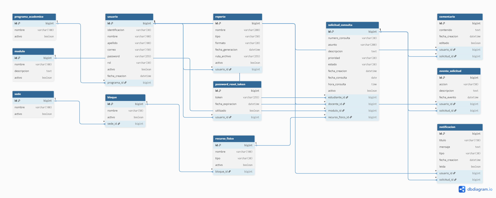

# Modelo de Datos

## Objetivo

El Sistema de Gestión de Consultas Académicas utiliza una base de datos relacional diseñada para representar de forma consistente los procesos involucrados en la gestión de consultas entre estudiantes y docentes.

El objetivo del modelo de datos es garantizar la integridad de la información, evitar redundancias, facilitar el mantenimiento del sistema y permitir su crecimiento mediante la incorporación de nuevos módulos sin afectar la estructura existente.

Durante el diseño se aplicaron principios de normalización, integridad referencial y buenas prácticas de modelado utilizadas en aplicaciones empresariales desarrolladas con Spring Boot y JPA.

El modelo fue diseñado considerando tanto los requerimientos funcionales del proyecto como la posibilidad de futuras ampliaciones, manteniendo una arquitectura desacoplada entre la lógica de negocio y la persistencia de datos.

---

# Filosofía de Diseño

El modelo de datos fue construido siguiendo una serie de principios de diseño que buscan garantizar una estructura consistente, escalable y fácil de mantener.

## Normalización

Las entidades fueron diseñadas evitando redundancia de información y manteniendo una correcta separación de responsabilidades entre cada tabla.

Cada dato se almacena únicamente en el lugar donde pertenece, evitando duplicidad y posibles inconsistencias durante las operaciones de actualización.

## Integridad Referencial

Todas las relaciones entre entidades se implementan mediante claves foráneas, garantizando que la información almacenada mantenga coherencia entre las diferentes tablas del sistema.

## Responsabilidad Única

Cada entidad representa un único concepto del dominio del negocio.

Por ejemplo:

- Usuario representa las personas que interactúan con el sistema.
- Programa Académico representa la carrera o programa al que pertenece un estudiante.
- SolicitudConsulta representa el ciclo completo de una consulta académica.
- Comentario almacena únicamente la conversación asociada a una solicitud.
- EventoSolicitud registra el historial de cambios realizados sobre cada solicitud.

Esta separación facilita el mantenimiento del sistema y reduce el acoplamiento entre módulos.

## Eliminación Lógica

Las entidades administrativas implementan eliminación lógica mediante el atributo `activo`.

De esta forma se conserva la información histórica sin eliminar físicamente registros que puedan estar relacionados con otras entidades.

Las entidades históricas, como Comentario, EventoSolicitud y Notificación, no implementan eliminación lógica debido a que representan información que forma parte del historial del sistema y debe conservarse de manera permanente.

## Uso de Enumeraciones

Todos los valores controlados por reglas del negocio se representan mediante enumeraciones (Enum), evitando el uso de cadenas de texto que puedan generar inconsistencias.

Entre las enumeraciones utilizadas se encuentran:

- Rol
- EstadoSolicitud
- PrioridadSolicitud
- TipoRecursoFisico
- TipoNotificacion
- TipoReporte
- AccionEventoSolicitud

## Escalabilidad

El modelo fue diseñado para permitir la incorporación de nuevos módulos sin afectar las relaciones existentes.

Esto facilita futuras ampliaciones del sistema sin necesidad de rediseñar la base de datos.

---

# Modelo Entidad - Relación

El siguiente diagrama representa la estructura relacional de la base de datos del Sistema de Gestión de Consultas Académicas.

En él se observan las entidades principales del sistema, sus relaciones, cardinalidades y dependencias.

---

## ProgramaAcademico

Representa los diferentes programas académicos ofrecidos por la institución.

Cada estudiante pertenece a un único programa académico, mientras que un programa puede estar asociado a múltiples estudiantes.

### Responsabilidad

Centralizar la información de los programas académicos y permitir su administración desde el sistema.

### Relaciones

- Un Programa Académico puede tener muchos Usuarios.
- Un Usuario pertenece únicamente a un Programa Académico.

### Observaciones

Esta entidad implementa eliminación lógica mediante el atributo `activo`, evitando la pérdida de información histórica.

---

## Usuario

Representa las personas que interactúan con el sistema.

Dependiendo de su rol, un usuario podrá actuar como estudiante, docente o administrador.

### Responsabilidad

Gestionar la autenticación, autorización y participación de los usuarios dentro del sistema.

### Relaciones

- Pertenece a un Programa Académico.
- Puede crear múltiples Solicitudes de Consulta como estudiante.
- Puede atender múltiples Solicitudes de Consulta como docente.
- Puede realizar Comentarios.
- Puede generar Eventos de Solicitud.
- Puede recibir Notificaciones.
- Puede generar Reportes.
- Puede poseer Tokens de Recuperación de Contraseña.

### Observaciones

Se utiliza una clave sustituta (`id`) como clave primaria.

La identificación del usuario se almacena como un atributo del dominio y posee una restricción UNIQUE.

Esto permite desacoplar la identidad del negocio de la identidad utilizada por la base de datos.

---

## Modulo

Representa las asignaturas o módulos académicos sobre los cuales los estudiantes pueden solicitar asesorías o consultas.

### Responsabilidad

Organizar las solicitudes académicas según la asignatura correspondiente.

### Relaciones

- Un Módulo puede estar asociado a múltiples Solicitudes de Consulta.

### Observaciones

La entidad implementa eliminación lógica para conservar el historial de solicitudes asociadas.

---

## Sede

Representa las diferentes sedes físicas de la institución educativa.

### Responsabilidad

Agrupar los bloques físicos donde se encuentran ubicados los recursos utilizados para las consultas académicas.

### Relaciones

- Una Sede contiene múltiples Bloques.

### Observaciones

Implementa eliminación lógica para conservar el historial del sistema.

---

## Bloque

Representa una división física perteneciente a una sede institucional.

### Responsabilidad

Organizar los recursos físicos disponibles dentro de cada sede.

### Relaciones

- Pertenece a una Sede.
- Contiene múltiples Recursos Físicos.

### Observaciones

La combinación entre el nombre del bloque y la sede debe ser única para evitar duplicidad de información.

---

## RecursoFisico

Representa los espacios físicos donde pueden desarrollarse las consultas académicas, tales como salones, laboratorios o auditorios.

### Responsabilidad

Gestionar los espacios disponibles para la programación de consultas.

### Relaciones

- Pertenece a un Bloque.
- Puede estar asociado a múltiples Solicitudes de Consulta.

### Observaciones

El tipo de recurso se representa mediante una enumeración (`TipoRecursoFisico`) para garantizar consistencia en la información.

---

## SolicitudConsulta

Representa el ciclo de vida completo de una consulta académica solicitada por un estudiante.

Una solicitud contiene toda la información necesaria para programar, gestionar y realizar una consulta, incluyendo el estudiante solicitante, el docente seleccionado, el módulo académico, el recurso físico asignado y el estado actual del proceso.

Esta entidad constituye el núcleo del dominio del sistema.

### Responsabilidad

Gestionar el proceso completo de una consulta académica desde su creación hasta su finalización.

### Relaciones

- Pertenece a un Estudiante.
- Puede ser atendida por un Docente.
- Pertenece a un Módulo.
- Se desarrolla en un Recurso Físico.
- Posee múltiples Comentarios.
- Posee múltiples Eventos de Solicitud.
- Puede generar múltiples Notificaciones.

### Observaciones

Cada solicitud posee un número único de consulta (`numeroConsulta`), independiente de la clave primaria de la base de datos.

El estado de la solicitud se controla mediante la enumeración `EstadoSolicitud`, permitiendo representar las diferentes etapas del proceso académico.

La prioridad también se representa mediante una enumeración (`PrioridadSolicitud`) para garantizar consistencia en la información.

La entidad implementa eliminación lógica mediante el atributo `activo`, conservando el historial del sistema.

---

## Comentario

Representa los mensajes intercambiados entre el estudiante y el docente durante el desarrollo de una solicitud de consulta.

Los comentarios permiten mantener un historial de comunicación asociado a cada solicitud.

### Responsabilidad

Registrar la conversación entre los participantes de una consulta académica.

### Relaciones

- Pertenece a un Usuario.
- Pertenece a una Solicitud de Consulta.

### Observaciones

Los comentarios forman parte del historial del sistema y no implementan eliminación lógica.

El atributo `editado` permite identificar si el contenido fue modificado después de su creación, manteniendo la trazabilidad de la conversación.

---

## EventoSolicitud

Representa el historial de eventos ocurridos durante el ciclo de vida de una solicitud de consulta.

Cada cambio relevante realizado sobre una solicitud genera un nuevo evento.

### Responsabilidad

Mantener la trazabilidad completa de las acciones realizadas sobre una solicitud.

### Relaciones

- Pertenece a una Solicitud de Consulta.
- Es generado por un Usuario.

### Observaciones

Los eventos almacenan información histórica y no implementan eliminación lógica.

Las acciones registradas se representan mediante la enumeración `AccionEventoSolicitud`.

Entre los eventos que pueden registrarse se encuentran:

- Creación de la solicitud.
- Asignación de docente.
- Cambio de estado.
- Reprogramación.
- Cancelación.
- Finalización.

---

## Notificacion

Representa los mensajes informativos generados automáticamente por el sistema para mantener informados a los usuarios sobre los cambios ocurridos en sus solicitudes de consulta.

### Responsabilidad

Informar oportunamente a los usuarios sobre eventos relevantes del sistema.

### Relaciones

- Pertenece a un Usuario.
- Puede estar asociada a una Solicitud de Consulta.

### Observaciones

Las notificaciones implementan el atributo `leida` para controlar si el usuario ya visualizó el mensaje.

No implementan eliminación lógica debido a que forman parte del historial de comunicación generado por el sistema.

---

## Reporte

Representa los reportes generados por el sistema a partir de la información almacenada en la base de datos.

Estos reportes permiten realizar consultas históricas, estadísticas o administrativas sobre las solicitudes de consulta y demás información del sistema.

### Responsabilidad

Conservar los reportes generados por los usuarios autorizados.

### Relaciones

- Es generado por un Usuario.

### Observaciones

La implementación definitiva de esta entidad dependerá de la estrategia acordada para el almacenamiento de los archivos generados.

Actualmente se contempla almacenar la información necesaria para identificar cada reporte generado, dejando abierta la posibilidad de conservar también el archivo físico correspondiente.

Implementa eliminación lógica mediante el atributo `activo`.

---

## PasswordResetToken

Representa los tokens temporales utilizados durante el proceso de recuperación de contraseña.

Esta entidad pertenece al módulo de autenticación y no participa directamente en la lógica funcional del sistema de consultas académicas.

### Responsabilidad

Garantizar un proceso seguro para el restablecimiento de contraseñas.

### Relaciones

- Pertenece a un Usuario.

### Observaciones

Cada token posee un tiempo de expiración y solo puede utilizarse una única vez.

Se mantiene una relación unidireccional con la entidad Usuario, decisión tomada para evitar complejidad innecesaria en el modelo de datos.

---

# Relaciones entre Entidades

El modelo relacional del sistema fue diseñado siguiendo relaciones de uno a muchos (1:N), evitando redundancia de información y manteniendo la normalización de la base de datos.

Las principales relaciones del sistema son las siguientes.

| Entidad Principal | Relación | Entidad Relacionada |
|-------------------|----------|----------------------|
| ProgramaAcademico | 1 : N | Usuario |
| Usuario (Estudiante) | 1 : N | SolicitudConsulta |
| Usuario (Docente) | 1 : N | SolicitudConsulta |
| Modulo | 1 : N | SolicitudConsulta |
| RecursoFisico | 1 : N | SolicitudConsulta |
| SolicitudConsulta | 1 : N | Comentario |
| SolicitudConsulta | 1 : N | EventoSolicitud |
| SolicitudConsulta | 1 : N | Notificacion |
| Usuario | 1 : N | Comentario |
| Usuario | 1 : N | EventoSolicitud |
| Usuario | 1 : N | Notificacion |
| Usuario | 1 : N | Reporte |
| Usuario | 1 : N | PasswordResetToken |
| Sede | 1 : N | Bloque |
| Bloque | 1 : N | RecursoFisico |

Todas las relaciones se implementan mediante claves foráneas, garantizando la integridad referencial entre las diferentes entidades del sistema.

---

# Restricciones de Integridad

Además de las relaciones entre entidades, la base de datos implementa diversas restricciones que garantizan la consistencia de la información.

## Claves Primarias

Todas las entidades utilizan una clave primaria sustituta (`id`) autogenerada mediante `GenerationType.IDENTITY`.

Esta decisión desacopla la identidad utilizada por la base de datos de los atributos propios del dominio del negocio.

## Claves Foráneas

Todas las relaciones entre entidades utilizan claves foráneas para garantizar la integridad referencial.

No es posible registrar información asociada a entidades inexistentes.

## Restricciones UNIQUE

Con el fin de evitar registros duplicados, algunas columnas implementan restricciones de unicidad.

| Tabla | Campo |
|--------|--------|
| Usuario | correo |
| Usuario | identificacion |
| ProgramaAcademico | nombre |
| SolicitudConsulta | numeroConsulta |
| Sede | nombre |
| Bloque | (nombre, sede) |
| RecursoFisico | (nombre, bloque) |

Estas restricciones permiten mantener la coherencia de la información almacenada.

## Restricciones NOT NULL

Los campos obligatorios del sistema utilizan restricciones `NOT NULL`, evitando el almacenamiento de información incompleta.

## Integridad Referencial

Las entidades dependientes no pueden existir sin la entidad principal a la que pertenecen.

Por ejemplo:

- Un Comentario siempre pertenece a una Solicitud.
- Un Bloque siempre pertenece a una Sede.
- Un Recurso Físico siempre pertenece a un Bloque.
- Un Evento siempre pertenece a una Solicitud.

Nota: Algunas restricciones compuestas (por ejemplo, (nombre, sede) en la entidad Bloque) se implementarán mediante restricciones de unicidad compuestas (@UniqueConstraint) durante el desarrollo de las entidades JPA.

---

# Índices

## ¿Qué es un índice?

Un índice es una estructura auxiliar creada por el sistema gestor de bases de datos con el objetivo de acelerar la búsqueda de información.

Su funcionamiento es comparable al índice de un libro: en lugar de recorrer todas las páginas para encontrar un tema, el índice permite localizar rápidamente la información deseada.

Aunque los índices incrementan ligeramente el espacio utilizado por la base de datos y el costo de las operaciones de inserción y actualización, mejoran considerablemente el rendimiento de las consultas más frecuentes.

Por esta razón, únicamente deben crearse sobre columnas que sean utilizadas de forma habitual en búsquedas, filtros o relaciones.

## Índices recomendados

| Tabla | Campo Indexado | Justificación |
|--------|----------------|---------------|
| Usuario | correo | Inicio de sesión y búsqueda de usuarios. |
| Usuario | identificacion | Consulta por documento de identidad. |
| SolicitudConsulta | estado | Filtrado por estado de la solicitud. |
| SolicitudConsulta | fechaConsulta | Agenda de consultas. |
| SolicitudConsulta | estudiante_id | Consultas realizadas por un estudiante. |
| SolicitudConsulta | docente_id | Consultas asignadas a un docente. |
| SolicitudConsulta | modulo_id | Consultas por módulo académico. |
| Comentario | solicitud_id | Mostrar la conversación de una solicitud. |
| EventoSolicitud | solicitud_id | Obtener el historial de una solicitud. |
| Notificacion | usuario_id | Mostrar las notificaciones del usuario. |
| Notificacion | leida | Consultar únicamente notificaciones pendientes de lectura. |

La creación de estos índices responde a los patrones de consulta previstos para el sistema y busca optimizar el rendimiento sin afectar la consistencia de la información.

### Ejemplo

Cuando un docente consulte todas sus solicitudes pendientes, el sistema ejecutará una búsqueda similar a:

- docente_id
- estado

Gracias a los índices definidos sobre estas columnas, la consulta podrá localizar los registros de forma más eficiente sin recorrer toda la tabla.

---

# Enumeraciones

Con el fin de mantener consistencia en la información almacenada y evitar valores inválidos, el sistema utiliza enumeraciones (Enum) para representar los diferentes estados y categorías del dominio.

Las enumeraciones implementadas son las siguientes.

| Enumeración | Descripción |
|-------------|-------------|
| Rol | Define el tipo de usuario del sistema (Administrador, Docente, Estudiante). |
| EstadoSolicitud | Representa el estado actual de una solicitud durante su ciclo de vida. |
| PrioridadSolicitud | Define el nivel de prioridad asignado a una solicitud. |
| TipoRecursoFisico | Clasifica los diferentes recursos físicos disponibles (Salón, Laboratorio, Auditorio, entre otros). |
| TipoNotificacion | Identifica el tipo de notificación generada por el sistema. |
| TipoReporte | Clasifica los diferentes reportes que pueden generarse. |
| AccionEventoSolicitud | Describe las acciones registradas en el historial de una solicitud. |

El uso de enumeraciones permite reducir errores de captura, mejorar la legibilidad del código y garantizar que únicamente se almacenen valores válidos definidos por las reglas del negocio.

---

# Decisiones de Arquitectura

Durante el diseño del modelo de datos se tomaron diversas decisiones arquitectónicas con el objetivo de garantizar un modelo consistente, mantenible y preparado para futuras ampliaciones.

## Uso de claves sustitutas

Todas las entidades utilizan una clave primaria autogenerada (`id`) como identificador interno.

Los atributos propios del dominio, como la identificación del usuario o el número de consulta, se almacenan como información del negocio y no como claves primarias.

Esta decisión desacopla la identidad de la base de datos de la identidad del dominio y facilita futuras modificaciones.

---

## Unificación de Consulta y SolicitudConsulta

El modelo original contemplaba entidades separadas para Consulta y Solicitud.

Durante el rediseño se identificó que ambas almacenaban información prácticamente idéntica.

Por esta razón se decidió unificar ambos conceptos en una única entidad denominada `SolicitudConsulta`, simplificando el modelo y eliminando redundancia de datos.

---

## Historial mediante EventoSolicitud

En lugar de modificar continuamente una solicitud y perder trazabilidad, cada cambio importante genera un nuevo registro en la entidad `EventoSolicitud`.

Esta estrategia permite reconstruir el historial completo de cualquier solicitud.

---

## Comentarios independientes

Los comentarios se almacenan en una entidad independiente para mantener separada la conversación de la información principal de la solicitud.

Esto facilita futuras ampliaciones, como archivos adjuntos o respuestas encadenadas.

---

## Eliminación lógica

Las entidades administrativas implementan eliminación lógica mediante el atributo `activo`.

Las entidades históricas no implementan este mecanismo debido a que representan información que debe conservarse permanentemente.

---

## Notificaciones

Las notificaciones implementan únicamente el atributo `leida`.

No se contempla eliminación lógica debido a que forman parte del historial de comunicación generado por el sistema.

---

## PasswordResetToken

La entidad `PasswordResetToken` mantiene únicamente una relación unidireccional con `Usuario`.

Se descartó implementar la relación inversa debido a que actualmente no aporta beneficios funcionales y aumentaría innecesariamente la complejidad del modelo.

---

## Escalabilidad

El modelo fue diseñado para permitir la incorporación de nuevos módulos sin modificar las relaciones existentes.

Esta decisión facilita la evolución del sistema y reduce el impacto de futuras ampliaciones.

---

# Posibles Mejoras Futuras

El modelo de datos fue diseñado considerando la posibilidad de incorporar nuevas funcionalidades sin afectar la estructura principal del sistema.

Entre las mejoras identificadas se encuentran:

- Implementar almacenamiento definitivo de archivos para los reportes generados.
- Incorporar programación automática de consultas mediante reglas de disponibilidad.
- Agregar control de disponibilidad de recursos físicos.
- Implementar recordatorios automáticos mediante notificaciones programadas.
- Incorporar carga de archivos adjuntos dentro de los comentarios.
- Registrar información estadística para la generación de indicadores académicos.
- Optimizar consultas mediante índices adicionales conforme aumente el volumen de información.
- Incorporar auditoría avanzada utilizando Spring Data Auditing.

Estas mejoras no forman parte del alcance actual del proyecto, pero el modelo fue diseñado para permitir su incorporación sin necesidad de realizar modificaciones estructurales significativas.

---

# Conclusión

El modelo de datos del Sistema de Gestión de Consultas Académicas fue diseñado aplicando principios de normalización, integridad referencial y buenas prácticas de modelado de bases de datos.

Las decisiones tomadas durante su construcción buscan garantizar la consistencia de la información, facilitar el mantenimiento del sistema y permitir su crecimiento mediante una arquitectura flexible y escalable.

Este documento constituye la referencia técnica para la implementación de las entidades JPA, los repositorios y la lógica de negocio desarrollada en el backend.