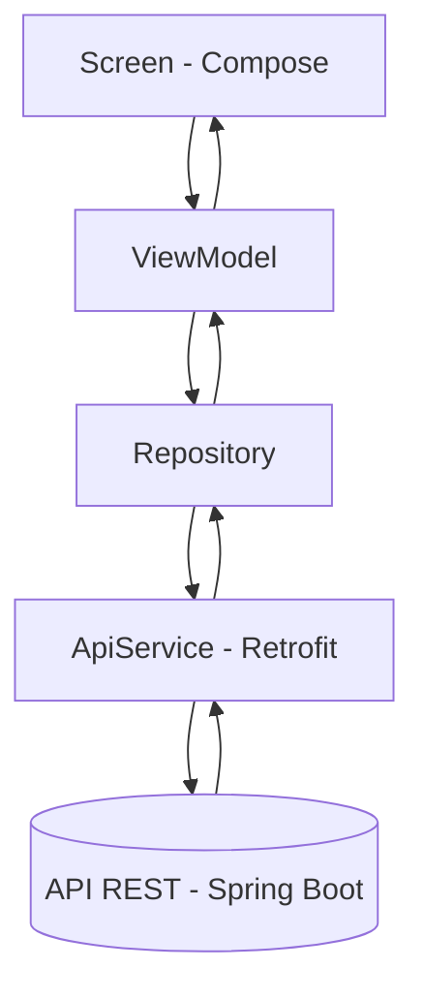

# Arquitectura del Cliente Móvil

## 1. Introducción

La app `iubconsultas/` es el cliente móvil nativo Android del Sistema de Gestión de Consultas Académicas. Está desarrollada con Kotlin y Jetpack Compose y consume la API REST del backend mediante Retrofit. Sigue el patrón **MVVM** con UI declarativa: cada pantalla (`Screen`) observa un estado (`UiState`) expuesto por su `ViewModel`, que a su vez delega el acceso a red en repositorios.

Es un cliente independiente del cliente web: comparte únicamente el contrato de la API documentado en Swagger.



---

# 2. Objetivo de la app

La app es responsable de:

- Autenticar al usuario (login/registro) contra `/auth`.
- Conservar la sesión (token JWT, usuario y rol) en memoria durante la ejecución.
- Dirigir a cada usuario a su home según el rol (Administrador, Docente, Estudiante).
- Administrar catálogos (usuarios, programas, módulos, sedes, bloques, recursos físicos).
- Gestionar solicitudes de consulta (listar, crear, actualizar, cambiar estado, asignar recurso, reasignar docente) y sus comentarios.
- Reflejar los estados de carga y error de red en la UI.

No implementa lógica de negocio del dominio: valida formato a nivel de pantalla y delega todas las reglas al backend.

---

# 3. Tecnologías utilizadas

| Tecnología | Versión | Uso |
|------------|---------|-----|
| Kotlin | 2.2.10 | Lenguaje de la app |
| Android Gradle Plugin | 9.2.1 | Build |
| compileSdk / targetSdk / minSdk | 37 / 36 / 24 | Nivel de API Android |
| Jetpack Compose (BOM) | 2026.02.01 | UI declarativa (Material3) |
| Navigation Compose | 2.8.9 | Navegación entre destinos |
| Lifecycle ViewModel Compose | 2.11.0 | `ViewModel` + `viewModelScope` |
| Retrofit / Converter Gson | 3.0.0 | Cliente HTTP y serialización JSON |
| OkHttp (vía Retrofit) | — | Interceptor de autorización |
| Java source/target | 11 | Compatibilidad de compilación |

Fuentes: `iubconsultas/gradle/libs.versions.toml`, `iubconsultas/app/build.gradle.kts`.

---

# 4. Estructura de paquetes

```text
com.example.iubconsultas
├── MainActivity.kt
├── data
│   ├── local
│   │   └── SessionManager.kt
│   ├── remote
│   │   ├── ApiService.kt
│   │   ├── RetrofitClient.kt
│   │   └── dto
│   │       ├── auth
│   │       ├── catalog
│   │       ├── comment
│   │       ├── consultation
│   │       └── user
│   └── repository
│       ├── AuthRepository.kt
│       ├── BlockRepository.kt
│       ├── CommentRepository.kt
│       ├── ConsultationRepository.kt
│       ├── ModuleRepository.kt
│       ├── ProgramRepository.kt
│       ├── ResourceRepository.kt
│       ├── SedeRepository.kt
│       └── UserRepository.kt
└── ui
    ├── component        # Composables reutilizables
    ├── navigation       # AppDestination, AppNavHost
    ├── screen           # login, register, home, users, programs,
    │                    # modules, sedes, blocks, resources, consultations
    └── theme            # Color, Theme, Type
```

Cada feature de `ui/screen/<feature>/` sigue el trío `Screen + ViewModel + UiState` (ver `02-Convenciones.md`).

---

# 5. Responsabilidad de cada capa

### ui/screen

Composables de pantalla. Solo renderizan el `UiState` y reenvían eventos de usuario al `ViewModel`. No llaman a la API directamente.

### ui/component

Composables reutilizables (`PrimaryButton`, `InputField`, `PasswordField`, `EmailField`, `DropDownSelector`, `SelectDialog`, `EditDialog`, `RoleSelector`, `AppHeader`, `ClickableText`). No conocen la API.

### ui/navigation

Destinos (`AppDestination`) y grafo (`AppNavHost`). Decide el home según el rol guardado en `SessionManager`.

### data/repository

Una clase por agregado (`AuthRepository`, `UserRepository`, `ConsultationRepository`, etc.). Reciben `ApiService` por constructor y exponen funciones `suspend` de una sola responsabilidad. No contienen lógica de UI.

### data/remote

`ApiService` (interfaz Retrofit con los endpoints), `RetrofitClient` (singleton que construye Retrofit + interceptor JWT) y DTOs de transporte. Detalle en `05-Integracion-API.md`.

### data/local

`SessionManager` (singleton en memoria con token, usuario, rol y bandera `sessionExpired`). Detalle en `03-Seguridad-Sesion.md`.

---

# 6. Flujo de una petición

1. El usuario interactúa con la `Screen` (p. ej. pulsa login).
2. La `Screen` invoca una función del `ViewModel` (p. ej. `login()`).
3. El `ViewModel` marca `isLoading = true` y lanza una corrutina en `viewModelScope`.
4. El `Repository` correspondiente llama a `ApiService` (Retrofit `suspend`).
5. El interceptor OkHttp de `RetrofitClient` añade `Authorization: Bearer <token>` si hay sesión.
6. La respuesta se mapea a éxito (`response.body()`) o error (mensaje en `UiState.error`).
7. La `Screen` recompone automáticamente al cambiar el `UiState`.

Si la API responde 401/403 con token presente, el interceptor marca la sesión como expirada y `SessionWatcher` redirige al login (ver `03-Seguridad-Sesion.md`).

---

# 7. Decisiones de arquitectura

- MVVM con UI declarativa: la `Screen` nunca conserva estado de negocio, todo vive en el `UiState` del `ViewModel`.
- Un `Repository` por agregado que envuelve a `ApiService`, para poder sustituir la fuente de datos sin tocar la UI.
- `RetrofitClient` como `object` singleton: una sola instancia de Retrofit/OkHttp en toda la app.
- Sesión en memoria (`SessionManager`): simple y suficiente para el alcance actual; no hay persistencia entre reinicios (ver limitación en `06-Build-Despliegue.md`).
- Navegación centralizada por rol en `AppNavHost`, sin destinos ocultos por pantalla.

---

# 8. Mejoras futuras

- Persistir la sesión (DataStore) para no perder el login al reiniciar la app.
- Inyección de dependencias (Hilt) en lugar de instanciar repositorios en cada `ViewModel`.
- Consumir los endpoints pendientes: `mis-solicitudes`, notificaciones y recuperación de contraseña.
- Paginación y búsqueda en listados (cuando el backend la exponga).
- Pruebas de `ViewModel` y pruebas de UI con Compose Test.
