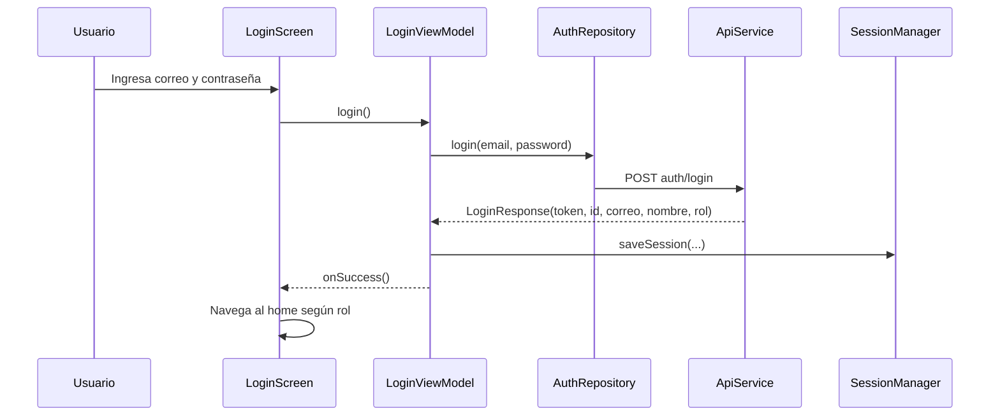
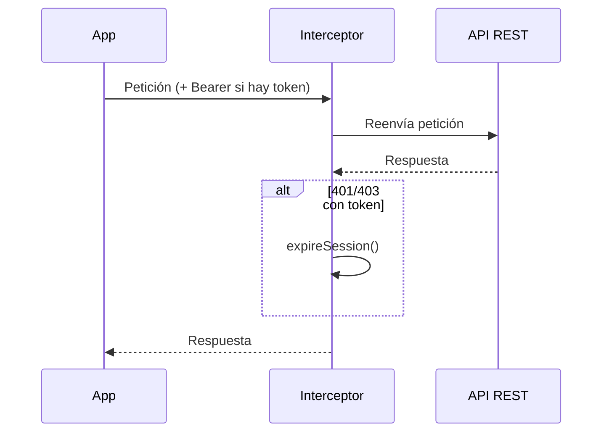

# Seguridad y Sesión en el Cliente Móvil

## 1. Introducción

La app delega toda la autenticación y autorización en el backend: inicia sesión contra `/auth/login`, conserva el JWT en memoria y lo adjunta como `Bearer` en cada petición. No almacena contraseñas ni decide permisos; el rol solo determina qué home y opciones muestra la UI.

---

# 2. Componentes

| Componente | Archivo | Responsabilidad |
|------------|---------|-----------------|
| `RetrofitClient` | `data/remote/RetrofitClient.kt` | Construir Retrofit + interceptor que inyecta el JWT |
| `SessionManager` | `data/local/SessionManager.kt` | Guardar sesión en memoria (token, usuario, rol, expiración) |
| `AuthRepository` | `data/repository/AuthRepository.kt` | Envolver `login`/`register` de `ApiService` |
| `LoginViewModel` | `ui/screen/login/LoginViewModel.kt` | Orquestar el login y guardar la sesión |
| `SessionWatcher` | `ui/screen/home/SessionWatcher.kt` | Redirigir al login cuando la sesión expira |
| `Role` | `data/remote/dto/auth/Role.kt` | `ADMINISTRATOR`, `TEACHER`, `STUDENT` (+ `label()` y `REGISTRATION_ROLES`) |

---

# 3. Flujo de login

El `LoginResponse` mapea los nombres del backend con `@SerializedName` (`correo` → `email`, `id_usuario` → `id`, `rol` → `role`, `nombre` → `name`).

---

# 4. Interceptor JWT

`RetrofitClient` añade un interceptor OkHttp que:

1. Lee `SessionManager.token`.
2. Si existe, agrega `Authorization: Bearer <token>` a la petición.
3. Si la respuesta es 401/403 con token presente, llama a `SessionManager.expireSession()`.

---

# 5. Expiración de sesión

`SessionManager.sessionExpired` es un `mutableStateOf`, por lo que Compose reacciona automáticamente. `SessionWatcher` lo observa con `LaunchedEffect`: al expirar, hace `logout()` (limpia token, usuario y rol) y ejecuta `onExpired()` para volver al login. Cada home (`Admin/Teacher/Student`) incluye este watcher.

---

# 6. Roles

| Rol backend | Enum app | Home | Registro permitido |
|-------------|----------|------|--------------------|
| ADMINISTRADOR | `ADMINISTRATOR` | `AdminHomeScreen` | No |
| DOCENTE | `TEACHER` | `TeacherHomeScreen` | Sí |
| ESTUDIANTE | `STUDENT` | `StudentHomeScreen` | Sí |

`REGISTRATION_ROLES = listOf(STUDENT, TEACHER)`: el registro público no permite crear administradores. `homeRouteForCurrentUser()` en `AppNavHost.kt` resuelve el destino según `SessionManager.role`.

---

# 7. Buenas prácticas aplicadas

- El token nunca se registra en logs ni se expone en la UI.
- Las contraseñas solo viajan en el cuerpo de `/auth/login` y `/auth/register`; jamás se guardan en el dispositivo.
- La expiración centralizada evita pantallas "colgadas" con 401 silenciosos.

---

# 8. Limitaciones conocidas

- Sesión solo en memoria: al cerrar/reiniciar la app hay que iniciar sesión de nuevo (mejora futura: DataStore con token persistente).
- `usesCleartextTraffic="true"` en el `AndroidManifest`: acepta HTTP para desarrollo local; en producción debe usarse HTTPS y retirarse ese permiso (ver `06-Build-Despliegue.md`).
