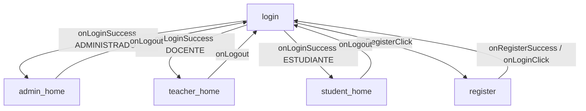

# Navegación y Roles del Cliente Móvil

## 1. Introducción

La navegación se implementa con Navigation Compose y está centralizada en `ui/navigation/`. Existen cinco destinos, y el home al que llega cada usuario depende del rol obtenido en el login. No hay navegación lateral global: cada home compone sus accesos a los módulos permitidos.

---

# 2. Destinos

Definidos en `AppDestination.kt` como `object` del `sealed class AppDestination`:

| Destino | Ruta | Pantalla |
|---------|------|----------|
| `Login` | `login` | `LoginScreen` (inicio de la app) |
| `Register` | `register` | `RegisterScreen` |
| `AdminHome` | `admin_home` | `AdminHomeScreen` |
| `TeacherHome` | `teacher_home` | `TeacherHomeScreen` |
| `StudentHome` | `student_home` | `StudentHomeScreen` |

---

# 3. Grafo (`AppNavHost`)

`AppNavHost.kt` declara el `NavHost` con `startDestination = login`:

- `login → onLoginSuccess`: navega al home según `homeRouteForCurrentUser()` y limpia `login` de la pila (`popUpTo ... inclusive = true`), para que "atrás" no vuelva al login.
- `login → onRegisterClick`: navega a `register`.
- `register → onRegisterSuccess / onLoginClick`: `popBackStack()` (vuelve al login).
- Cada home recibe `onLogout`: navega a `login` limpiando su propio destino de la pila.

---

# 4. Homes por rol

| Home | Archivo | Contenido |
|------|---------|-----------|
| Administrador | `ui/screen/home/AdminHomeScreen.kt` | Acceso a gestión de usuarios, catálogos (programas, módulos, sedes, bloques, recursos) y solicitudes |
| Docente | `ui/screen/home/TeacherHomeScreen.kt` | Solicitudes asignadas, comentarios y cambios de estado |
| Estudiante | `ui/screen/home/StudentHomeScreen.kt` | Creación y seguimiento de sus solicitudes |

Los tres homes montan `SessionWatcher` para redirigir al login si el backend invalida el token (ver `03-Seguridad-Sesion.md`). El estado de cada home vive en `HomeUiState`/`HomeViewModel`.

---

# 5. Pantallas de funcionalidad

Desde los homes se accede a las pantallas de `ui/screen/`: `users`, `programs`, `modules`, `sedes`, `blocks`, `resources` y `consultations`. Cada una sigue el trío `Screen + ViewModel + UiState` y carga sus datos al inicializarse (p. ej. `ConsultationsViewModel.init` carga solicitudes, usuarios, módulos y recursos).

---

# 6. Reglas de navegación

- No usar rutas literales fuera de `AppDestination`.
- Al entrar a un home tras login/logout, limpiar la pila con `popUpTo ... inclusive = true` para impedir volver atrás a estados de sesión inválidos.
- Todo destino nuevo debe registrarse en `AppNavHost` y documentarse en la tabla de destinos de este archivo.
