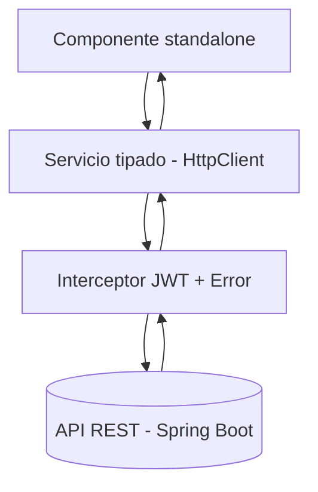

# Arquitectura del Cliente Web (Angular)

## 1. Introducción

El cliente web Angular (`FRONTEND/`) es la SPA que reemplaza al cliente vanilla (`Frontend/` en HTML/CSS/JS). Consume la misma API REST del backend sin cambiar el contrato: el backend y la app móvil (`iubconsultas/`, ver `docs/movil/`) no se modifican por esta migración, salvo los ajustes puntuales listados en `02-Auditoria-Cliente-Web-Backend.md` (W-06, W-07, W-13, W-14, W-15).

Implementa la **arquitectura por módulos con lazy-loading** exigida por el punto 3 de `01-Plan-Migracion.md`: cada recurso del dominio es un módulo Angular perezoso con su propio routing, páginas, componentes y servicio tipado.



Base técnica: Angular 22 standalone (`bootstrapApplication` en `src/main.ts`, `appConfig` en `src/app/app.config.ts`, rutas en `src/app/app.routes.ts`). Sin `NgModule`: se usa `provideRouter`, `provideHttpClient(withInterceptors(...))` y `loadChildren`/`loadComponent`.

---

# 2. Objetivo del cliente web

- Paridad funcional con `Frontend/`, corregida contra la auditoría (`docs/web/02-Auditoria-Cliente-Web-Backend.md`).
- Login/registro contra `/auth`, guards por rol (Administrador, Docente, Estudiante).
- CRUD de catálogos: usuarios, programas, módulos, sedes, bloques, recursos físicos.
- Solicitudes: crear, listar, `mis-solicitudes`, cambio de estado, asignación de recurso, reasignación de docente.
- Comentarios por solicitud y visualización de notificaciones; recuperación de contraseña.
- Formularios reactivos con validación espejo de Bean Validation; estados de carga/error en todas las vistas.

No implementa reglas de negocio del dominio: valida formato en cliente y delega todo lo demás al backend.

---

# 3. Tecnologías utilizadas

| Tecnología | Versión | Uso |
|------------|---------|-----|
| Angular / CLI / build | 22.2.0 | Framework, router, build (`application` builder) |
| `@angular/forms` | 22.2.0 | Formularios reactivos + validación |
| RxJS | ~7.8.0 | `HttpClient`, operadores en servicios |
| Tailwind CSS / PostCSS | 4.1.12 / 8.5.3 | Estilos (`src/styles.css`) |
| TypeScript | ~6.0.2 | Lenguaje (`tsconfig.app.json`) |
| Vitest / jsdom | 5.0.0 / 30.0.0 | Tests unitarios (`ng test`) |
| Prettier | 3.8.1 | Formato (`.prettierrc`) |
| pnpm | 12.6.0 (`packageManager`) | Gestor de paquetes |

Comandos: `pnpm install`, `pnpm start` (`ng serve`, dev en `http://localhost:4200/`), `pnpm build`, `pnpm test`. Fuente: `FRONTEND/package.json`, `FRONTEND/angular.json`.

---

# 4. Estructura de carpetas (scaffolding creado)

```text
FRONTEND/src/
├── environments/
│   ├── environment.ts          # dev:  apiUrl → http://localhost:8080
│   └── environment.prod.ts     # prod: apiUrl → API dockerizada (ver 05-Docker.md)
└── app/
    ├── core/
    │   ├── guards/             # auth.guard, role.guard (canActivate/canMatch por rol)
    │   ├── interceptors/       # jwt.interceptor, error.interceptor (401→login)
    │   ├── services/           # auth.service, session.service, api base
    │   └── layout/             # shell por rol (header/nav admin-docente-estudiante)
    ├── shared/
    │   ├── components/         # loading, error-message, confirm-dialog (motivo de rechazo), empty-state
    │   ├── directives/         # directivas reutilizables (si se necesitan)
    │   └── pipes/              # pipes de presentación (fecha/hora, estado)
    ├── models/                 # interfaces 1:1 con los DTOs + enums del contrato
    └── features/               # un módulo lazy por recurso (ver §5)
        ├── auth/               # login, register, forgot-password, reset-password
        ├── usuarios/
        ├── programas/
        ├── modulos/
        ├── sedes/
        ├── bloques/
        ├── recursos-fisicos/
        ├── solicitudes/        # crear, listar, mis-solicitudes, cambio-estado, asignar-recurso, reasignar-docente
        ├── comentarios/
        └── notificaciones/
```

Cada carpeta contiene hoy un `.gitkeep` y recibe su contenido durante la migración. `app.config.ts` / `app.routes.ts` / `app.ts` (shell con `<router-outlet>`) ya existen y no se tocan salvo para registrar providers y rutas lazy.

## Para qué sirve cada carpeta

- **`environments/`**: única fuente de `apiUrl` por perfil. Los servicios nunca hardcodean la URL (corrige el problema de `BASE_URL` del móvil; aquí se resuelve con `environment.ts` / `environment.prod.ts`).
- **`core/guards/`**: `authGuard` (¿hay JWT válido?) y `roleGuard` (¿el rol permite esta ruta?). Se aplican en el routing, nunca con `if` escondidos en componentes.
- **`core/interceptors/`**: `jwtInterceptor` (añade `Authorization: Bearer <token>` salvo en `/auth/**`) y `errorInterceptor` (traduce el `ErrorResponse` del backend y redirige a login ante 401/403). Equivalente web del interceptor OkHttp + `SessionWatcher` del móvil.
- **`core/services/`**: `auth.service` (login/register/forgot/reset + persistencia de sesión), `session.service` (token, usuario, rol, expiración). El resto de servicios vive junto a su feature (§5), no aquí.
- **`core/layout/`**: cascarón visual por rol (cabecera, navegación, `<router-outlet>` anidado). Evita duplicar el menú en cada página.
- **`shared/components|directives|pipes/`**: piezas tontas reutilizables, sin `HttpClient` ni routing. Si algo solo se usa en una feature, vive en esa feature, no aquí.
- **`models/`**: contrato tipado. Una interfaz por DTO del backend (`LoginRequest`, `RegistroSolicitudRequest`, `SolicitudResponse`, …) y enums reales (`EstadoSolicitud`, `PrioridadSolicitud`, `Rol`, `TipoEvento`). Cero fallbacks `x || y || z` (corrige W-16): si el backend no lo devuelve, no existe en la interfaz.
- **`features/<recurso>/`**: módulo funcional completo y perezoso (detalle en §5).

---

# 5. Módulos por feature (lazy-loading)

Cada feature replica esta forma:

```text
features/solicitudes/
├── solicitudes.routes.ts       # ROUTES del módulo (se carga con loadChildren desde app.routes.ts)
├── services/
│   └── solicitudes.service.ts  # HttpClient tipado contra /solicitudes-consultas (ver tabla)
├── pages/                      # componentes de ruta (listar, crear, detalle, mis-solicitudes)
└── components/                 # componentes solo de esta feature (tabla-estado, dialogo-motivo)
```

Registro en `app.routes.ts` (forma a seguir por cada feature):

```ts
{ path: 'solicitudes', loadChildren: () => import('./features/solicitudes/solicitudes.routes').then(m => m.SOLICITUDES_ROUTES), canMatch: [authGuard, roleGuard] }
```

Mapa feature → endpoint (contrato en `docs/05-API.md` y Swagger; rama `develop`):

| Feature | Endpoints que consume |
|---------|----------------------|
| `auth` | `POST /auth/login`, `POST /auth/register`, `POST /auth/forgot-password`, `POST /auth/reset-password` |
| `usuarios` | `GET /usuarios`, `GET /usuarios/{id}`, `PUT /usuarios/{id}` (payload exacto W-06), `DELETE /usuarios/{id}` (inactivar) |
| `programas` | CRUD `GET/POST /programas`, `PUT/DELETE /programas/{id}` (crear: solo `nombre`, W-09) |
| `modulos` | CRUD `/modulos` (crear: `nombre` + `descripcion` 10–500, sin "código", W-09) |
| `sedes` | CRUD `/sedes` (solo `nombre`, sin `id`/`ubicacion`, W-09) |
| `bloques` | CRUD `/bloques` (`nombre` + sede) |
| `recursos-fisicos` | CRUD `/recursos-fisicos` (`nombre` + tipo + bloque) |
| `solicitudes` | `GET/POST /solicitudes-consultas`, `GET /solicitudes-consultas/mis-solicitudes` (cuando el backend la exponga, W-13), `PUT /solicitudes-consultas/{id}`, `PATCH .../{id}/estado` (Aceptar → `EN_PROCESO`, Rechazar → `RECHAZADA` + `motivo` obligatorio, W-02/W-03), `PATCH .../{id}/recurso-fisico`, `PATCH .../{id}/docente`. Sin formulario de creación en rol docente (W-05); sin `URGENTE` (W-10); crear con los 7 campos exactos del DTO, sin `numeroConsulta`/`estudianteId`/`recursoFisicoId` (W-04). |
| `comentarios` | `GET /comentarios/solicitud/{id}`, `POST /comentarios`, `PUT /comentarios/{id}` (W-12/W-13: los comentarios viven aquí, no en la respuesta de solicitud) |
| `notificaciones` | `GET /notificaciones` (+ marcar leída si el backend la expone) |

Notas de contrato que condicionan la UI (ver auditoría):

- Enums reales: `EstadoSolicitud = PENDIENTE, EN_PROCESO, RESUELTA, RECHAZADA, CANCELADA`; `PrioridadSolicitud = ALTA, MEDIA, BAJA`. Nada de `ACEPTADA/URGENTE/AGENDADA/REALIZADA`.
- Respuesta de solicitud trae `nombrePrograma`, no `programa`; no trae `firma` ni comentarios (quitar columna firma/QR y librería `html5-qrcode` sin uso, W-12).
- `GET /programas` es público (para el registro); `POST /solicitudes-consultas` debe exigir JWT — verificar tras W-14.

---

# 6. Flujo de una petición

1. El usuario navega a una ruta lazy (p. ej. `/solicitudes`); el guard verifica sesión y rol.
2. La página (componente standalone con `signal`s) llama a su `*.service` (p. ej. `solicitudesService.listar()`).
3. El servicio usa `HttpClient` tipado con `apiUrl` de `environments/`.
4. `jwtInterceptor` añade el Bearer; `errorInterceptor` mapea el `ErrorResponse {timestamp,status,error,message,errors}` del backend.
5. La página refleja `isLoading/error/datos` con componentes de `shared/`; ante 401/403 redirige a `/auth/login`.

Estado actual: `app.config.ts` solo registra `provideRouter(routes)`; al implementar, añadir `provideHttpClient(withInterceptors([jwtInterceptor, errorInterceptor])))`.

---

# 7. Decisiones de arquitectura

- Standalone + lazy por feature: sin `NgModule`; cada feature se carga bajo demanda (punto 3 del plan).
- Un servicio tipado por recurso junto a su feature (no un "api.service" gigante); `core/services` solo para auth/sesión.
- Interfaces 1:1 con los DTOs (generadas o copiadas de Swagger); `strict` de TypeScript como guardián del contrato (W-16).
- Guards e interceptores funcionales (`CanActivateFn`, `HttpInterceptorFn`), registrados una vez en `appConfig`.
- Formularios reactivos con validadores espejo de Bean Validation (detalle en `04-Convenciones.md`).
- Sesión: `session.service` (memoria + `localStorage` para persistir el JWT entre recargas; cerrar sesión limpia todo). El móvil pierde la sesión al reiniciar; la web no debe heredar esa limitación.

---

# 8. Relación con Docker (ver `05-Docker.md`, pendiente)

El punto 3 del plan pide además `Dockerfile` multistage (build + Nginx) y `docker-compose` (API + web + MySQL). La arquitectura ya lo prevé: `environment.prod.ts` apunta a la API dockerizada y no hay URLs hardcodeadas en servicios. Recomendación de secuencia (corta): **desarrollar primero con `ng serve` y dockerizar al final** — el HMR es más rápido que reconstruir imágenes, el CORS del backend ya permite `*` en dev, y el único riesgo Docker-específico (rutas case-sensitive tipo W-01) se valida en una pasada final. Excepción: si necesitas probar en Linux/Nginx antes, adelanta solo el `Dockerfile` sin bloquear el desarrollo en él.
